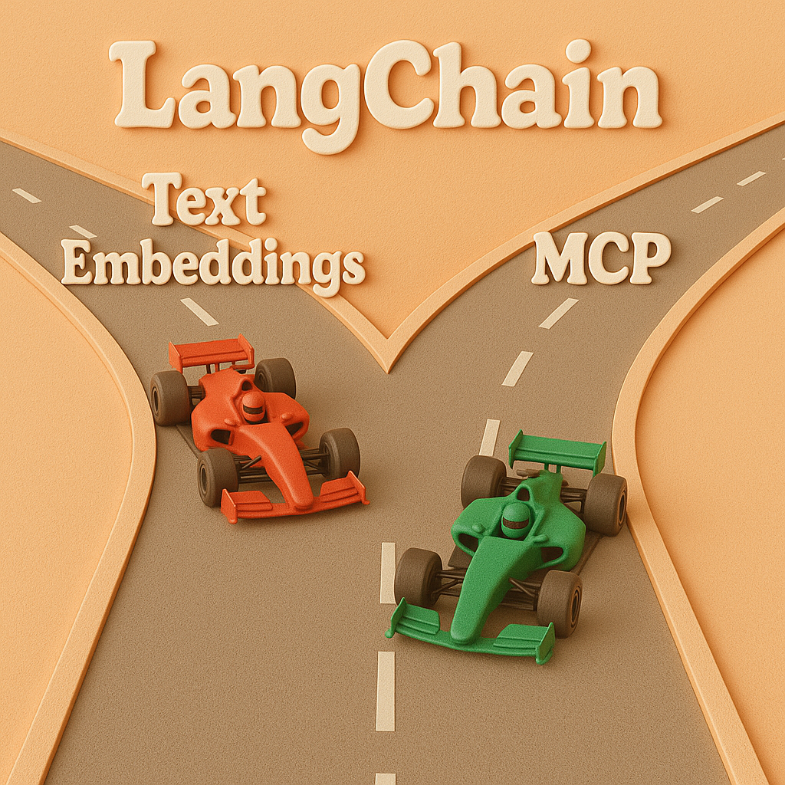

# The Layers of AI: How Embeddings, MCP, and LangChain Work Together

If you’re a developer in the AI space, you’ve probably felt like you’re drinking from a firehose. New models, frameworks, and protocols pop up every week. Three terms you’ll often hear are **Text Embeddings**, the **Model Context Protocol (MCP)**, and **LangChain**.

At first glance, they might seem like overlapping or competing ideas. But the truth is, they aren't competitors at all. They are distinct, synergistic layers of the modern AI stack.

Understanding how they fit together is the key to moving beyond simple chatbots and building truly powerful, data-aware applications. Let’s break it down with simple analogies.

---

## Layer 1: The Substance — Text Embeddings

Imagine you need to give a computer a "feeling" for language. How would you explain that "king" and "queen" are related in the same way "man" and "woman" are? You can't just give it a dictionary.

This is where embeddings come in.

*   **The Analogy:** Text embeddings are like **GPS coordinates for meaning**.

An embedding model takes a piece of text—a word, a sentence, or an entire document—and converts it into a list of numbers called a vector. This vector is its unique address in a high-dimensional "meaning space." Texts with similar meanings have coordinates that are close to each other.

This is the foundation of almost all modern AI. It’s how machines can search for concepts, not just keywords. It’s the *substance* that LLMs process.

> **The Takeaway:** Embeddings translate fuzzy human language into a mathematical format that machines can understand and reason with. They are the raw material of meaning.

---

## Layer 2: The Universal Connector — The Model Context Protocol (MCP)

Now that our AI can understand meaning, how do we connect it to the outside world? How do we give it access to our local files, a company database, or a third-party API like Jira without building a fragile, one-off integration for each?

This is the problem the standardized **Model Context Protocol (MCP)** is built to solve.

*   **The Analogy:** MCP is the **USB-C port for AI**⚡.

Introduced as an open-source standard and championed by companies like Anthropic, MCP’s goal is to create a universal protocol for AI models (or any "host" application) to connect with any data source or tool (a "server").

Before, if you wanted to connect your LLM to Notion, you needed a custom-built Notion adapter. If you also needed Salesforce, you had to build another one. It was a world of proprietary chargers.

MCP creates a single, standard plug. A tool developer can expose their data via an MCP "server," and any AI model or application that speaks MCP can instantly connect to it. This makes the ecosystem vastly more interoperable and scalable.

> **The Takeaway:** MCP isn’t the AI itself; it’s the standard communication channel that allows an AI to securely and reliably get context from the outside world.

---

## Layer 3: The Brains of the Operation — LangChain

We have our substance (embeddings) and a standard port to connect tools (MCP). But what actually decides *what to do*? What asks the question, fetches the data, thinks about it, and takes the next step?

This is where an orchestration framework like LangChain comes in.

*   **The Analogy:** If MCP is the USB-C port, LangChain is the **Operating System**.

Your computer’s OS uses the standard USB-C ports to manage your keyboard, webcam, and external drive. But it does more than just connect them; it *orchestrates* them to run a complex application like a video conference. The OS handles the logic, and the ports handle the connection.

This is exactly what LangChain does for AI.

1.  **Orchestration:** LangChain provides the cognitive architecture for building multi-step applications. For example, an "agent" built with LangChain might perform a loop:
    *   **Think:** The LLM decides what tool to use.
    *   **Act:** It uses MCP to connect to that tool (e.g., query a Salesforce database).
    *   **Observe:** It gets the result back from the tool.
    *   **Repeat:** It feeds the result back into the LLM to decide the next step.
    MCP handles the "Act" step’s connection, but LangChain manages the entire reasoning loop.

2.  **Abstraction:** While MCP standardizes the connection to tools, you still have different LLM providers (OpenAI, Google, Anthropic) with their own APIs. LangChain abstracts this away. You can write your logic once and switch the underlying LLM with a single line of code.

LangChain lets you focus on your application's logic—the "what"—without getting bogged down in the "how" of connecting each individual component.

## Putting It All Together

These three concepts form a perfect stack, each handling a different level of abstraction.

| Layer | Concept | Its Role in the Stack | Analogy |
| :--- | :--- | :--- | :--- |
| **Orchestration** | **LangChain** | The cognitive framework that decides what to do and in what order. | The Operating System |
| **Connection** | **MCP** | The standard port for connecting the AI to any tool or data source. | The USB-C Port |
| **Substance** | **Embeddings** | The mathematical representation of meaning that is being processed. | GPS Coordinates |

So, is LangChain still relevant now that MCP exists? Absolutely. A standard for ports (MCP) doesn't make an operating system (LangChain) obsolete; it makes it more powerful by simplifying one part of its job.

The future of AI development isn't about a single tool winning out. It’s about building with layers of abstraction that work in harmony. By understanding the distinct roles of embeddings, MCP, and LangChain, you can build smarter, more scalable, and more robust AI applications.
